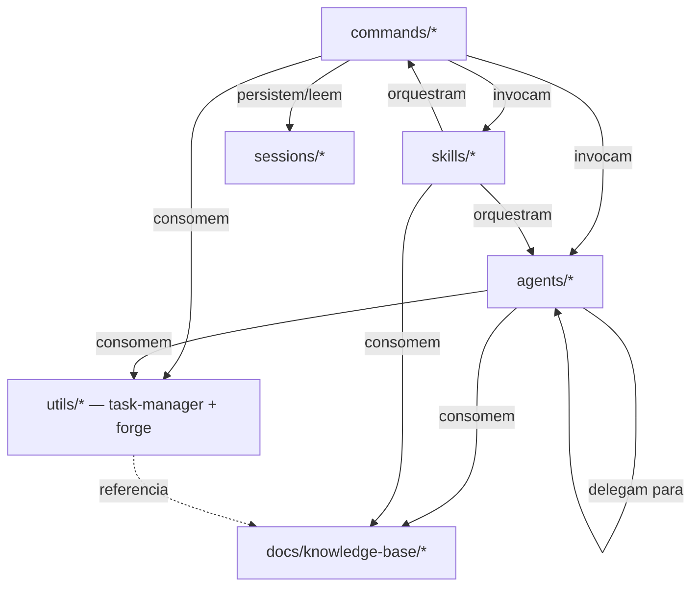

# Meta-spec — Arquitetura do Sistema Onion

## Propósito

Define a estrutura de diretórios obrigatória, o princípio de **framework instalável** e as dependências permitidas entre categorias. Esta spec normatiza o que constitui o "esqueleto" do Sistema Onion como artefato reutilizável em projetos-alvo.

Aplica-se ao **Sistema Onion**, não ao projeto-alvo onde o Onion é instalado.

Referências relacionadas:

- [agents.md](./agents.md), [commands.md](./commands.md)
- [code-standards.md](./code-standards.md), [integrations.md](./integrations.md)

---

## 1. Estrutura de diretórios obrigatória

### 1.1 Root do framework

```
.claude/                    # Operacional — artefatos invocáveis pelo Claude Code
docs/                       # Documentação consumida por humanos e IA
README.md                   # Identidade e ponto de entrada
CLAUDE.md                   # Regras de operação para Claude Code
CONTRIBUTING.md             # Guidelines para evolução
.env, .env.example          # Configuração de providers e integrações
```

### 1.2 Estrutura de `.claude/`

```
.claude/
├── agents/                 # Agentes especializados
│   ├── compliance/         # 5 agentes — frameworks regulatórios
│   ├── deployment/         # 1 agente — containerização
│   ├── development/        # 18 agentes — especialistas técnicos
│   ├── git/                # 5 agentes — review pré-PR
│   ├── meta/               # 5 agentes — orquestração e criação
│   ├── product/            # 9 agentes — discovery e spec
│   ├── research/           # 1 agente — pesquisa
│   ├── review/             # 2 agentes — code review
│   └── testing/            # 3 agentes — testes
│
├── commands/               # Comandos invocáveis
│   ├── common/             # Templates e prompts compartilhados
│   ├── design/             # Vertical de design (INCUBAÇÃO — categoria provisória; ver ADR design-peer-promotion)
│   ├── development/        # Comandos de desenvolvimento
│   ├── docs/               # Geração e validação de documentação
│   ├── engineer/           # Workflow faseado de implementação
│   ├── git/                # GitFlow (feature/, hotfix/, release/)
│   ├── meta/               # Criação de artefatos do Onion
│   ├── product/            # Workflow faseado de descoberta e spec
│   ├── quick/              # Análises pontuais
│   ├── test/               # Estratégias de teste
│   ├── validate/           # Validação (test-strategy/, qa-points/, collab/)
│   ├── onion.md            # Ponto de entrada inteligente
│   ├── warm-up.md          # Preparação geral de contexto
│   └── catch-up.md         # Briefing de retomada (onde paramos)
│
├── skills/                 # Skills (cérebro)
│   ├── onion/              # Orquestrador master
│   ├── onion-orchestration/  # Orquestração de workers (fan-out paralelo)
│   ├── onion-patterns/     # Padrões e nomenclatura
│   ├── onion-validation/   # Regras de validação
│   └── language-standards/ # Padrões de idioma
│
├── sessions/               # Estado persistente de workflows faseados
│   └── <feature>/          # Por feature em desenvolvimento
│
├── utils/                  # Abstrações e utilitários (SDAAL) + insumos operacionais de agentes
│   ├── task-manager/       # Task Manager Abstraction (factory, interface, types, detector, adapters/)
│   ├── forge/              # Forge Abstraction — PR/review/CI/Release no host remoto (GitHub; gh-first, REST fallback)
│   ├── c4-*.md             # Templates/regras C4 consumidos pelos agentes c4-* (detection, templates, mermaid, documentation)
│   └── date-time-standards.md  # Padrões de data/hora
│
├── rules/                  # Regras complementares (opcional)
└── validation/             # Scripts de validação: inventory.sh, onion-version.sh, lint, federation-*
```

### 1.3 Estrutura de `docs/`

```
docs/
├── INDEX.md                # Hub de navegação
│
├── meta-specs/             # L0 — constituição do framework (esta spec é uma delas)
│   ├── index.md
│   ├── agents.md
│   ├── commands.md
│   ├── architecture.md
│   ├── code-standards.md
│   └── integrations.md
│
├── analysis/               # Análises críticas datadas (snapshots)
├── plans/                  # Planos de execução
│
├── onion/                  # Documentação operacional (guias, referências, releases)
│
├── knowledge-base/         # KBs estruturadas para consumo por IA
│   ├── concepts/
│   ├── frameworks/
│   ├── tools/
│   ├── platforms/
│   └── providers/
│
├── sdaal/                  # KB ativa sobre o padrão SDAAL
│
├── business-context/       # Template vazio — populado no projeto-alvo
├── technical-context/      # Template vazio — populado no projeto-alvo
├── compliance-context/     # Template vazio — populado no projeto-alvo (quando aplicável)
└── design-context/         # INCUBAÇÃO — 4º peer candidato, provisório (ver decisions/onion-adr-design-peer-promotion)
```

---

## 2. Separação `.claude/` vs `docs/`

| Aspecto | `.claude/` | `docs/` |
|---|---|---|
| Natureza | Operacional | Documentação |
| Consumido por | Claude Code (em runtime) | Humanos + IA (em leitura) |
| Formato | Markdown estruturado para execução | Markdown para consumo informacional |
| Versionamento | Junto com PRs que alteram comportamento | Junto com PRs que mudam doutrina ou descobertas |
| Acesso pelo usuário final | Indireto via invocação (`/<comando>`, `@<agente>`) | Direto via leitura de arquivos |

**Regra**: artefato invocável vive em `.claude/`; descrição/explicação/análise vive em `docs/`.

---

## 3. Princípio de framework instalável

O Sistema Onion deve ser **instalável em qualquer projeto** (novo, legado ou regulado) **copiando ou clonando `.claude/` e `docs/`** sem necessidade de adaptação de paths absolutos.

### 3.1 Premissas que o framework PODE assumir sobre o projeto-alvo

- Tem `.claude/` no root do projeto (estrutura padrão do Claude Code)
- Tem um arquivo `CLAUDE.md` no root que pode ser sobrescrito ou estendido
- Pode ter `.env` no root (criado a partir de `.env.example` via `/meta:setup-integration`)
- Pode (mas não precisa) ter `docs/` para os contextos spec-as-code

### 3.2 Premissas que o framework NÃO PODE assumir

- Path absoluto específico (ex: `/home/<user>/`)
- Existência de monorepo, NX, ou estrutura específica
- Linguagem de programação específica (Node, Python, Go)
- Provider de Task Manager pré-configurado
- Existência de `git` inicializado

### 3.3 Implicações

- Comandos e agentes devem usar **paths relativos** ou variáveis de ambiente
- Configuração específica do projeto-alvo vai em `.env` (não em comandos/agentes)
- Detecção de stack/linguagem deve ser dinâmica (`/docs:reverse-consolidate`)

---

## 4. Dependências permitidas entre categorias

### 4.1 Diagrama de dependências



### 4.2 Regras de dependência

| De → Para | Permitido | Notas |
|---|---|---|
| `commands/*` → `agents/*` | Sim | Padrão de delegação |
| `commands/*` → `skills/*` | Sim | Quando precisa de orquestração |
| `commands/*` → `utils/*` | Sim | Abstrações reutilizáveis (Task Manager) |
| `commands/*` → `sessions/*` | Sim | Workflows faseados persistem estado |
| `agents/*` → `agents/*` | Sim | Delegação entre especialistas |
| `agents/*` → `docs/knowledge-base/*` | Sim | KBs como referência |
| `agents/*` → `utils/*` | Sim | Especialmente Task Manager |
| `agents/*` → `commands/*` | **Não** | Agente não invoca comando diretamente — sugere ao usuário |
| `skills/*` → `commands/*`, `agents/*`, `docs/*` | Sim | Skills são orquestradores |
| `utils/*` → `agents/*`, `commands/*` | **Não** | Abstrações devem ser puras |
| `compliance/` → `engineer/` (direto) | **Não** | Coordenação via `meta/` ou `docs/build-compliance-docs` |

### 4.3 Acoplamento entre dimensões

As três dimensões peer (produto, engenharia, compliance) **não devem ter dependências cruzadas diretas** em nível de comando. Coordenação acontece via:

- **Sessions** (estado compartilhado)
- **Meta-comandos** em `meta/`
- **Skills** orquestradoras (`skill: onion`)
- **Documentação consolidada** em `docs/`

---

## 5. Plataforma alvo

**Sistema Onion roda exclusivamente em Claude Code.**

Implicações:

- Não há suporte planejado para Cursor, Continue, Cline ou outras CLIs
- Não há CLI standalone (`onion init/add/migrate` foram abandonados em 2026-05-18)
- Não há produto npm distribuído
- Mudanças na plataforma Claude Code (estrutura de `.claude/`, formato de skills, novas tools) podem exigir atualização do framework

---

## 6. Estrutura de release e versionamento

### 6.1 Versionamento

- Versão do framework: implícita no estado do branch `main` (não há semver formal)
- Versão de meta-specs: campo `version` no frontmatter, semver simples (`1.0.0`)
- Releases significativas: registradas em `docs/onion/RELEASE-NOTES-*.md` quando aplicável

#### Stamp de versão (proveniência de repos adotados)

A identidade do framework é **derivada do git** (commit + data), **não** um semver — coerente com
"versão implícita no `main`" acima. O script `.claude/validation/onion-version.sh` (irmão de
`inventory.sh`) a emite ao vivo:

```yaml
framework: onion-evolve
commit: <ref-curta>
commit_date: <YYYY-MM-DD>
role: source
```

O repo-**fonte** (este) **não** carrega stamp committado — evita auto-referência arquivo↔commit e churn.
Em repos **adotados**, `/meta:adopt` escreve `.claude/.onion-version` com a identidade da fonte + campos
de **proveniência**:

```yaml
framework: onion-evolve
source_commit: <ref-curta da fonte na adoção>
source_commit_date: <YYYY-MM-DD>
role: adopted
adopted_from: <repo/URL da fonte>
adopted_at: <YYYY-MM-DD>       # data da 1ª adoção — NUNCA re-carimbada pelo --update
updated_at: <YYYY-MM-DD>       # OPCIONAL — data do último --update (presente após o 1º update)
mode: greenfield | legacy | regulated
integration_branch: <branch>   # OPCIONAL — presente só quando escolhido via --integration-branch
```

O campo **`integration_branch`** (opcional) é o **SSOT versionado** da branch de integração — a que os PRs
de evolução Onion miram (ex. `<projeto>-evolve`, separada da branch de produto). É **carimbado só quando
escolha explícita** (`/meta:adopt --integration-branch <nome>`); **ausente** é o caso normal. A base do PR
é resolvida por `.claude/validation/resolve-integration-branch.sh` na cadeia: **(1)** este campo se presente
→ **(2)** `git config gitflow.branch.develop` → **(3)** default **detectado** (`develop` se a branch existir,
senão a branch principal `main`/`master`). Consumido pelo `/engineer:pr`. Vive no stamp **porque `git config`
é local da máquina e não viaja no clone** — o versionado garante a mesma base de PR em qualquer máquina;
quando ausente, a detecção (passo 3) adapta-se ao repo a cada PR.

> **PROPOSTO (design-alvo, gated — não shipped):** `integration_branch` é **um papel de branch**. O ADR
> [branch-roles-sdaal](../analysis/onion-adr-branch-roles-sdaal-2026-07.md) generaliza a resolução de base de
> **1 papel** para **N papéis** por faceta (fluxo/ambiente/linhagem), via um mapa `branch_roles:` no stamp:
> ```yaml
> branch_roles:            # PROPOSTO — schema-alvo; consumido só a partir da Fase 1 (gated)
>   integration: <branch>  # faceta flow (alias do integration_branch shipped)
>   production: main        # faceta environment
>   staging: develop        # faceta environment (ex. um adotante regulado: develop=stage) — sem default; Null Object se ausente
> ```
> Quando implementado, `integration_branch` (campo **shipped** acima) permanece aceito como **alias** de
> `branch_roles.integration` — retrocompat total; `resolve-integration-branch.sh` vira shim de
> `resolve-branch-role.sh integration`. Enquanto na Fase 0, **só `integration_branch` é lido**; `branch_roles`
> é schema documentado, ainda não consumido.

Adicionar este **arquivo** (não diretório) não fere §7. Consumidores: `/meta:adopt` (escreve), `/engineer:pr`
(lê `integration_branch`), a **federação** (versão de cada membro) e o CI. Decisão: [ADR de Adoção](../analysis/onion-adr-repo-adoption-2026-06.md).

### 6.2 Sessões e estado

- A **estrutura** de `.claude/sessions/<slug>/` (worklog ACTIVE vs registro ARCHIVED, `STATE.md`, etc.) é definida pela SSOT em [`gitflow-patterns.md` §Contrato de Sessão](../knowledge-base/frameworks/gitflow-patterns.md#contrato-de-sessão-de-desenvolvimento); a mecânica de eficácia de IA, em [`worklog-protocol.md`](../knowledge-base/concepts/worklog-protocol.md). Esta metaspec **não redefine** a estrutura.
- **Versionamento é escolha consciente por projeto**, não um default imposto: pode ser *gitignored* (estado individual/efêmero) ou *committed* (artefato durável de time/auditoria — postura adotada, por exemplo, pelo projeto-alvo `o app de um adotante`). Ver a sub-seção "Versionamento de sessões" na SSOT.
- O `.gitignore` default do Onion ships a postura **gitignore-active** com comentário que aponta para a política, para o adotante flipar conscientemente; ao commitar, prefira versionar `archived/` e gitignorar os dirs ACTIVE.
- No repo do Onion (este repositório), `.claude/sessions/` é gitignored (não há worklogs versionados aqui).

---

## 7. Proibições explícitas

- **Proibido** criar diretório de primeiro nível fora dos listados em Seções 1.2 e 1.3 sem PR específico para esta meta-spec
- **Proibido** introduzir `.onion/` ou estrutura agnóstica alternativa (abandonado em 2026-05-18)
- **Proibido** criar `packages/` ou diretório de pacote distribuível (abandonado em 2026-05-18)
- **Proibido** comando invocar agente fora da relação permitida (ver Seção 4.2)
- **Proibido** depender de path absoluto

---

## 8. Ciclo de vida de documentação de contexto

Os contextos de domínio (`docs/business-context/`, `docs/technical-context/`,
`docs/compliance-context/`) são **SSOT viva com ciclo de vida CRUD+**, não artefatos gerados uma
única vez. A geração pelos comandos `/docs:build-*-docs` é o **primeiro tick**; manter o contexto
fiel à realidade é parte da sua definição. A gramática completa vive na KB
[domain-context-lifecycle.md](../knowledge-base/concepts/domain-context-lifecycle.md); a decisão,
no [ADR de ciclo de vida de contexto](../analysis/onion-adr-domain-context-lifecycle-2026-06.md).

Regras normativas:

1. **Frescor obrigatório.** Cada arquivo de contexto carrega uma marcação `Última Atualização`. O
   threshold de frescor é herdado de [`/meta:kb-freshness`](../../.claude/commands/meta/kb-freshness.md):
   marcação ausente ou **> 18 meses** torna o arquivo candidato a `STALE`. (Gancho para a barreira
   de staleness do CI — Tijolo 2.)
2. **Pesos derivados, não declarados.** A relevância de um fragmento é *derivada* (posição na
   progressive-disclosure + frescor + tier de evidência). **Proibido** número mágico de prioridade
   no frontmatter (ex.: `priority: 0.8` manual).
3. **Remover e Validar são de primeira classe.** Documentação de contexto stale **engana
   ativamente** (pior que ausente); removê-la é operação de frescor, não perda. Validar
   (rastreabilidade + frescor + ausência de contradição cross-domínio) é o portão de confiança.
4. **Três domínios peer + critério de promoção.** Business/technical/compliance são peers; as
   sub-camadas Decisional (ADRs) e Operacional/Runtime vivem dentro de `technical-context/`.
   Promove-se uma sub-camada a peer (pasta `*-context/` própria) **apenas** quando valem juntos
   **dono distinto × ritmo de mudança distinto × decisão distinta que informam** — nunca por
   organograma.

---

## 9. Versionamento e mudanças

Mudanças nesta spec exigem:

1. PR específico para `docs/meta-specs/architecture.md`
2. Atualização do campo `version`
3. Avaliação de impacto em comandos/agentes existentes
4. Aprovação por `@metaspec-gate-keeper`
